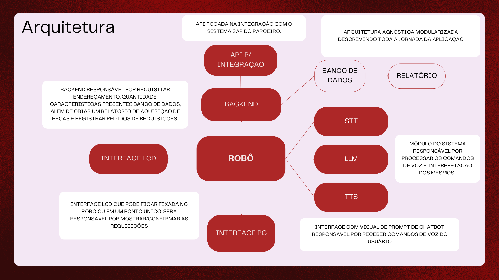

# Descrição da Arquitetura do Sistema

Essa seção da documentação está destinada a arquitetura do sistema. O grupo optou por desenvolver três arquiteturas diferentes do sistema a fim de ter um entendimento melhor do desafio proposto pelo parceiro e desenvolver uma arquitetura mais robusta.
As arquiteturas foram divididas da seguinte forma:

- Arquitetura de nível conceitual
- Arquitetura de nível lógico
- Arquitetura de nível sistêmico

## Arquitetura de nível conceitual

Como o próprio termo remete, a arquitetura conceitual é focada em entender o conceito de como a aplicação irá funcionar. O grupo optou por fazer a construção de uma arquitetura dessa forma pelo seu nível de abstração, esse tipo de arquitetura, diferentemente das duas seguintes, não fala sobre tecnologias ou a parte técnica da aplicação, mas sim dos módulos que estarão presentes na mesma e suas respectivas responsabilidades.

O fluxo interno seguiria o seguinte percurso:

- O usuário entra em contato com o robô com um comando de voz por meio do módulo interface pc
- O robô direciona esse comando para os três módulos na direita. O STT sendo responsável por converter de fala para texto o comando, o LLM interpretando essa informação de linguagem natural e o TTS convertendo essa informação já interpretada de volta para fala.
- O passo anterior foi pensado para manter um nível alto de acessibilidade de fala, contemplando diferentes grupos na aplicação. Pois, além da informação interpretada ser exibida na tela LCD para confirmação, o robô também a exibirá de forma falada
- A interpretação de comando então é entendida pelo robô como uma requisição, esse por sua vez, redireciona o pedido para o backend, que faz uma consulta no banco de dados sobre o endereço daquela requisição, quantidade 3 características da peça, por exemplo.
- O resultado dessa requisição é exibido na interface LCD e após a confirmação da viabilidade da requisição, o robô começa a movimentação.
- Além dessa responsabilidade, o módulo backend também é responsável por criar um relatório de requisições contendo informações para controle de estoque, como: endereço da peça, nome, quantidade, características, horário e nome do requisitante. Tudo isso a fim de conseguir integrar esse backend com a API do SAP do parceiro.

## Segunda versão da arquitetura

Na Sprint 3, foi decidido trocar um pouco a arquitetura, pensando em formas melhores de controlar o robô e as requisições feitas ao longo do sistema.

O fluxo dessa nova arquitetura seguiria o seguinte percurso:

- O usuário entra em contato com o robô com um comando de voz ou texto por meio do módulo interface web ou por meio de um comando de voz ao robô com STT;
- O comando é processado pelo backend e, este, mediante confirmação do usuário, envia requisições HTTP para os nós do pacote ROS que inicializam a navegação do robô;
- No fim do processo de navegação, o sistema ROS retorna para o backend um relatório sobre a navegação do robô, permitindo a baixa dos itens guardados ou alguma outra mensagem de erro;
- Além disso, toda conversa com o robô ou com o chatbot passa pelo LLM utilizando o OPENAI para manter uma conversa que faça sentido dentro do contexto;
- O backend acessa um banco de dados com toda a relação de itens com suas respectivas posições no almoxarife.