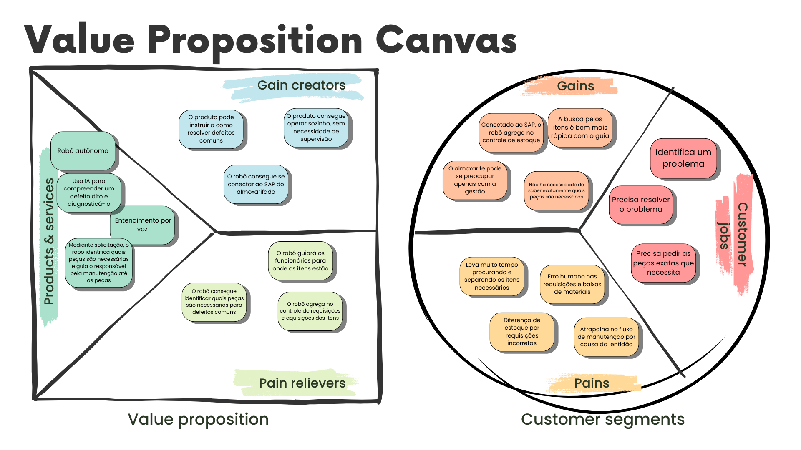

# Proposta de Valor 

O Canvas de Proposta de Valor é uma ferramenta visual fundamental, simplificando a descrição e análise da proposta de uma empresa. Essencial para compreender e inovar na entrega de valor aos clientes, destaca diferenciais competitivos, orienta estratégias de marketing e embasa decisões estratégicas. Em suma, é crucial para empresas que buscam se destacar no mercado por meio de propostas de valor eficazes e diferenciadas.

## Customer Segment

A seção de Customer Segment no Canvas de Proposta de Valor refere-se à identificação e caracterização dos diversos segmentos de clientes para os quais a empresa está criando valor de maneira distintiva.

### Customer Jobs

Os "customer jobs" no Canvas de Proposta de Valor representam tarefas ou objetivos específicos que os clientes buscam realizar, destacando as necessidades ou problemas que a empresa se propõe a resolver para proporcionar valor aos clientes.

- Identificação e elaboração de soluções
- Requisição eficiente de peças necessárias

### Pains

As "pains" (dores) no Canvas de Proposta de Valor referem-se a desafios, frustrações ou problemas enfrentados pelos clientes, onde a empresa pode oferecer soluções ou alívio para melhor atender às necessidades do cliente.

- Busca demorada e propensa a erros de itens necessários
- Diferenças no estoque devido a requisições incorretas
- Interrupções no fluxo de manutenção devido à lentidão

### Gains

Os "gains" (ganhos) no Canvas de Proposta de Valor representam benefícios, expectativas atendidas ou melhorias percebidas pelos clientes ao utilizar os produtos ou serviços da empresa.

- Conexão ao SAP para melhor controle de estoque
- Agilidade na busca por itens com o guia do robô
- Foco do almoxarife na gestão.

## Value Proposition

A seção de Value Proposition no Canvas de Proposta de Valor descreve de forma concisa e visual as ofertas específicas da empresa, destacando como ela resolve problemas e atende às necessidades dos clientes, proporcionando valor único e diferenciado no mercado.

### Products & Services

A seção "Products and Services" (Produtos e Serviços) no Canvas de Proposta de Valor descreve de maneira sucinta os principais produtos ou serviços oferecidos pela empresa, enfocando as características essenciais que atendem às necessidades e desejos dos clientes.

- Robô autônomo
- IA para diagnóstico de defeitos
- Entendimento por voz
- Identificação e guia do robô para peças necessárias mediante solicitação

### Pain relievers

"Pain relievers" (Alívios de Dores) no Canvas de Proposta de Valor referem-se a elementos específicos da oferta da empresa que buscam resolver ou mitigar problemas e desafios enfrentados pelos clientes, proporcionando soluções eficazes e satisfatórias.

- Identificação eficiente de peças necessárias pelo robô
- Orientação do robô para a localização dos itens
- Aprimoramento do controle de requisições e aquisições pelo robô

### Gain creators

"Gain creators" no Canvas de Proposta de Valor são elementos da oferta da empresa que geram benefícios e valor adicional para os clientes, destacando características que contribuem positivamente para atender às expectativas e necessidades dos usuários.

- Instruções do produto para resolver defeitos comuns
- Operação autônoma do produto, sem supervisão necessária
- Conexão do robô ao SAP do almoxarifado para maior eficiência.