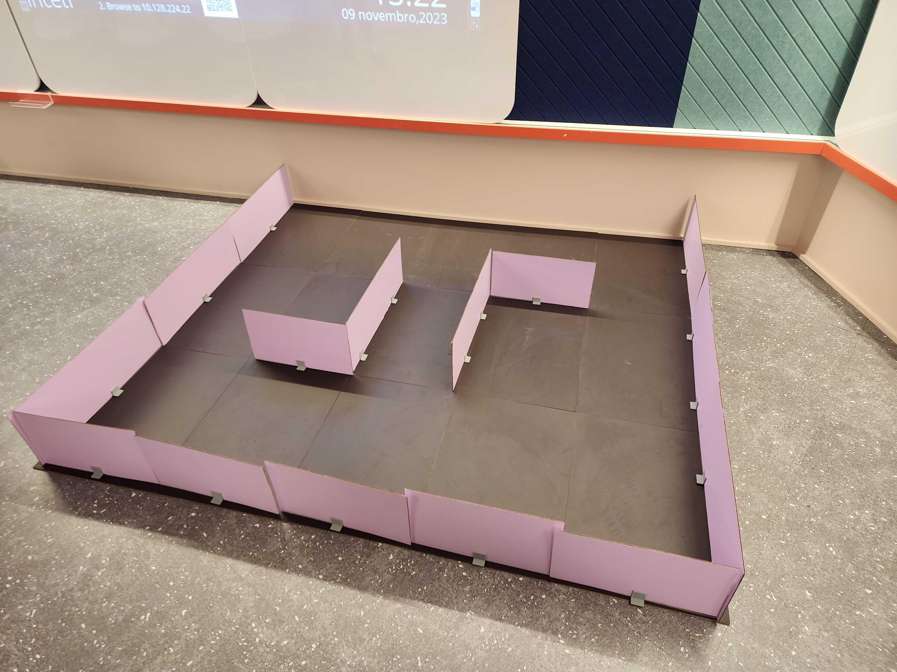

# Sistema de Localização e Mapeamento Simultâneo

Durante a Sprint 3, direcionamos nossos esforços para a contínua melhoria do sistema de localização e mapeamento simultâneos.

## Mapeamento

Na Sprint 2, alavancamos as tecnologias Nav2, Rviz e o nó turtlebot3 teleop para mapear o ambiente. A interação era baseada em comandos de navegação enviados via teclado, permitindo o controle manual do robô para explorar estrategicamente o espaço.

Na Sprint 3, não houve modificações significativas nesse processo. O mapeamento continuou desempenhando um papel crucial, possibilitando ao robô mapear sem dificuldades em ambientes desconhecidos, identificando obstáculos e registrando coordenadas essenciais para a construção precisa do mapa.

## Navegação

Na Sprint 2, aprimoramos a navegação com um nó inicializador do Nav2, essencial para coordenar os movimentos do robô. Utilizamos o Simple Commander para direcionar o robô à posição inicial do mapa, simplificando os comandos de movimento.

Dessa maneira, na Sprint 3, essa estrutura permaneceu inalterada. A navegação continuou eficiente, com o usuário capaz de enviar pontos pré-definidos para o robô via chat por linha de comando. Essa interação flexível permitiu a adição de vários destinos até a confirmação de todos os pontos desejados.

Os pontos registrados foram acessados pelo Simple Commander, guiando o robô de forma intuitiva para cada posição definida. Essa abordagem continua oferecendo uma interação simples e adaptável, permitindo explorar o ambiente de maneira precisa e personalizada.

Além disso, o LLM foi incorporado para aprimorar a interação do usuário com o chatbot. Isso permitiu esclarecer dúvidas sobre peças necessárias para solucionar problemas específicos. Especialmente notável é a capacidade do chatbot em fornecer informações precisas sobre a localização dessas peças no mapa, otimizando a experiência do usuário na resolução de questões técnicas.

## Pacote Chofer

O pacote 'chofer' é um conjunto de componentes cruciais para a navegação e controle do TurtleBot Burger, composto por vários arquivos-chave.

O `mapper.py` é um nó ROS essencial neste pacote. Responsável pelo mapeamento e navegação, ele permite interação com o teclado para realizar ações específicas durante a operação do robô. Ao inicializar, cria um thread para escutar as entradas do teclado, possibilitando que o usuário pressione a tecla 's' para salvar o mapa. 

A função `keyboard_listener` configura o terminal para leitura bruta, continua a ler o teclado indefinidamente e responde à tecla 's' acionando a função `save_map`, que executa um comando do sistema para salvar o mapa usando o pacote `nav2_map_server`. Esse nó é fundamental para o pacote 'chofer', permitindo ao operador salvar o mapa do ambiente durante a navegação do TurtleBot Burger.

```
def keyboard_listener(self):
    # Seleciona o modo de leitura do teclado
    fd = sys.stdin.fileno()
    old_settings = termios.tcgetattr(fd)
    
    # Leitura do teclado
    try:
        self.get_logger().info("Press 's' to save the map.")
        tty.setraw(fd)
        while True:
            key = sys.stdin.read(1) 
            if key.lower() == 's': self.save_map()
            elif key == '\x03': break
    
    # Caso ocorra algum erro, exibe o erro na tela
    except Exception as e:
        self.get_logger().error('Could not read key: %r' % e)
    
    # Restaura o modo de leitura do teclado
    finally:
        termios.tcsetattr(fd, termios.TCSADRAIN, old_settings)
```

Além disso, o pacote 'chofer' inclui o arquivo `mapper.launch.py`, que integra o mapper.py ao sistema de lançamento (launch system) do ROS 2. Este arquivo configura o lançamento do nó mapper juntamente com outros componentes necessários, como o lançamento do cartógrafo do TurtleBot Burger (turtlebot3_cartographer) e o controle de teleop via teclado (turtlebot3_teleop). Ao executar este lançamento, é possível iniciar o mapeamento do ambiente e controlar o robô com o teclado, facilitando a criação do mapa durante a operação.

Por outro lado, temos o arquivo `navigator.py`, outro nó crucial do pacote 'chofer'. Responsável por aceitar comandos de waypoints através do tópico /waypoints, guia o TurtleBot Burger até pontos específicos no mapa. Este nó utiliza a biblioteca rclpy para se comunicar com o sistema ROS 2. Ao ser inicializado, instancia a classe BasicNavigator do pacote `nav2_simple_commander` para controlar a navegação básica do robô. Recebe mensagens do tópico `/waypoints`, interpreta os dados como pares de coordenadas (x, y) representando destinos no mapa e, com base nessas coordenadas, guia o robô até o ponto desejado. Essencial para a capacidade de navegação autônoma do TurtleBot Burger, este nó contribui significativamente para a precisão de movimento do robô no ambiente.

O `navigator.launch.py`, por sua vez, é um arquivo de lançamento que integra o navigator.py ao sistema de lançamento do ROS 2. Ao executar este lançamento, o nó navigator é iniciado juntamente com o turtlebot3_navigation2, que configura a navegação do TurtleBot Burger. Isso permite ao robô receber comandos de navegação por waypoints e realizar movimentos precisos no ambiente, facilitando a sua capacidade de navegar autonomamente pelo ambiente mapeado.

Esses arquivos e nós, em conjunto, compõem o pacote 'chofer', fornecendo funcionalidades cruciais para o mapeamento, navegação e controle do TurtleBot Burger no ambiente.

## Conexão com o robô

Para estabelecer a conexão com o robô e enviar comandos, é imperativo acessar o terminal do robô por meio de uma conexão SSH. Em seguida, execute o comando a seguir:
```
ros2 launch turtlebot3_bringup robot.launch.py
```

## Preparativos para a execução de um nó

Antes de executar nós ROS2, é essencial realizar os seguintes comandos na raiz do workspace onde os pacotes estão localizados:
```
colcon build
source install/local_setup.bash # ou altere para zsh, se necessário
```
A partir desse ponto, qualquer nó dentro desse workspace pode ser iniciado por meio de seu executável.

## Execução do mapeamento 

Para iniciar o lançador que executará todos os nós necessários para o mapeamento, utilize o seguinte comando:

```
ros2 launch chofer mapper.launch.py
```

## Execução da navegação

Para acionar o lançador utilizado na navegação, empregue o seguinte comando:
```
ros2 launch chofer navigator.launch.py
```

## Demonstração do mapeamento

### Circuito real x Circuito mapeado




## Demonstração da navegação

<iframe width="560" height="315" src="https://www.youtube.com/embed/VTZQujUkQRs?si=LM92U75XIe5w-iH_" frameborder="0" allow="autoplay; encrypted-media" allowfullscreen></iframe>

## Checklist de requisitos

Os seguintes requisitos não funcionais foram atendidos corretamente pela implementação da Sprint 3:

- O sistema deve ser capaz de mapear um espaço de 50m² em cerca de 10 minutos
- O robô deve encontrar a melhor rota para chegar nos seus destinos em menos de 20 minutos

Contudo, é importante destacar que o seguinte requisito foi violado, uma vez que o robô apresentou dificuldades em se manter distante de obstáculos, por isso durante o desenvolvimento da Sprint 3 retiramos o LCD, atualmente conectado a carcaça do robô.

- O robô deve ter uma margem de segurança em suas rotas de, pelo menos, 5cm

