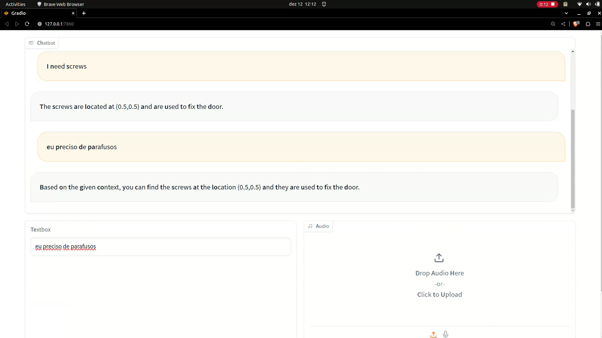

# Interface Gradio

Anteriormente, a interface estava baseada em linhas de comando. No entanto, visando proporcionar uma experiência mais amigável ao usuário, optou-se por incorporar a ferramenta Gradio. Essa escolha possibilitou a implementação eficaz e rápida de um chat, resultando em uma significativa melhoria na experiência do usuário.

Nesta sprint, também foram implementados os processos de Speech-to-Text (STT) e Text-to-Speech (TTS). Para viabilizar esses procedimentos de maneira adequada, foram adicionados campos de texto e um microfone à interface para a entrada de informações. Para lidar devidamente com essa entrada, realiza-se uma verificação para determinar se o conteúdo recebido pertence ao componente de texto ou de áudio. Se o texto for recebido, essa informação é encaminhada diretamente ao LLM, que por sua vez envia o output de volta ao componente de chat para exibição da resposta.

No entanto, se o conteúdo recebido pertencer a um áudio, essa informação passa inicialmente pelo processo de STT, sendo transcrita antes de ser enviada ao LLM. Esse processo repete a dinâmica mencionada anteriormente, proporcionando uma integração eficiente entre as interfaces de texto e áudio.

## Como executar

A interface está inserida no nó de LLM, logo, para que ela seja inicializada, execute na raíz do workspace:

```
colcon build
source install/local_setup.bash # substitua por zsh, se necessário
ros2 run chat llm
```

## Demonstração

