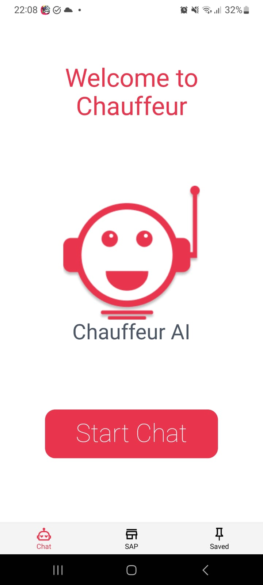
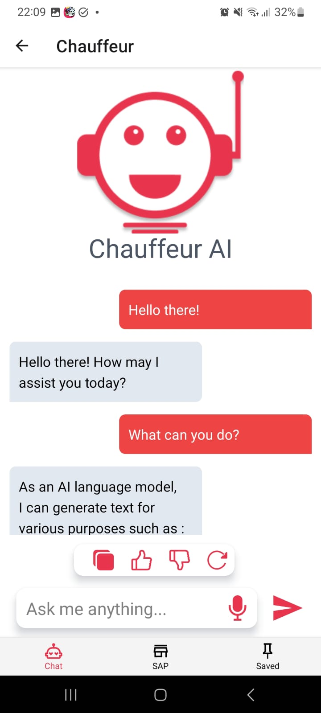

# Interface Mobile

Anteriormente, foi apresentado o protótipo da interface de usuário utilizando o figma. Na sprint 4, o desenvolvimento da interface mobile foi iniciado utilizando [React Native](https://reactnative.dev).

Um design mais simplista é a melhor escolha para tornar uma interface mais tranquila de ser usada. Além de possuir 
A decisão de iniciar uma interface mobile foi montada pensando na usabilidade do usuário, uma vez que uma interface acessada pelo celular é mais prática e facilita o processo para o usuário.

## Bibliotecas utilizadas

- [React Native](https://reactnative.dev): Framework javascript para desenvolvimento mobile baseaado no [React](https://react.dev);
- [NativeWind](https://www.nativewind.dev): Framework css para desenvolvimento em react native baseado no [Tailwindcss](https://tailwindcss.com);
- [Expo](https://expo.dev): Framework para desenvolvimento mobile que compila e permite a execução do projeto e, também, o seu deploy.

## Resultados

As telas desenvolvidas até o momento são a tela de inicialização do sistema e a de chat. A conversa demonstrada não está integrada, logo, ela foi mockada pelo desenvolvedor.

<div style={{"margin": "0 auto", "max-width": "400px", "display": "flex", "justify-content": "space-around"}}>

<div style={{"padding-right": "30px"}}>



</div>



</div>

É notório o design intuitivo e de fácil uso. As cores condizem com a identidade visual do grupo, Chauffeur, tal como a tipografia usada nas nossas apresentações. 
A interface foi projetada para satisfazer dispositivos móveis, com um fluxo de usuário simples.

No tocante a usabilidade e acessibilidade da interface, ainda há nada implementado, tendo em vista que ela ainda está em desenvolvimento. Mas é planejado colocar alternativas para áudio, integrações com serviços de acessibilidade, em todas as imagens são colocados os argumentos "alt", para a descrição da imagem caso esta não renderize, etc.

Tendo isso em vista, ainda falta a integração de todas as funcionalidades ao backend que está sendo desenvolvido em conjunto. Futuramente essas questões de integração serão abordadas neste documento.

## Como executar

Para instalar as dependências necessárias e inicializar a interface, execute:

```
npm i
npm expo start
```