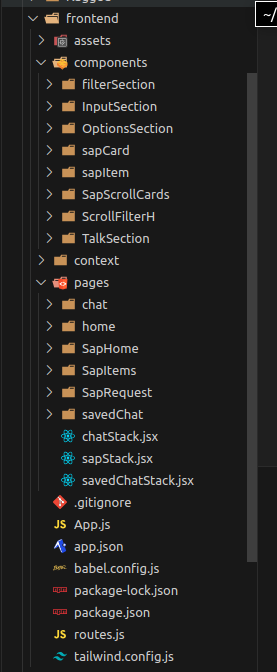
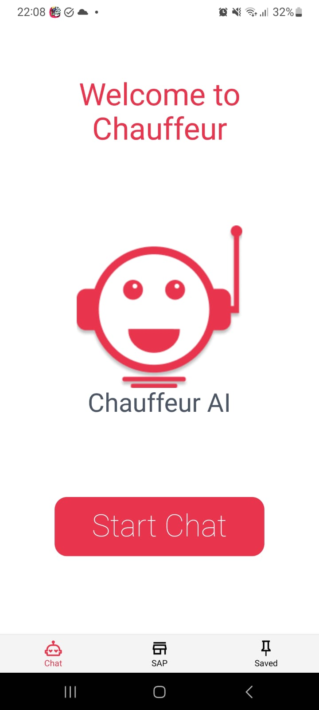
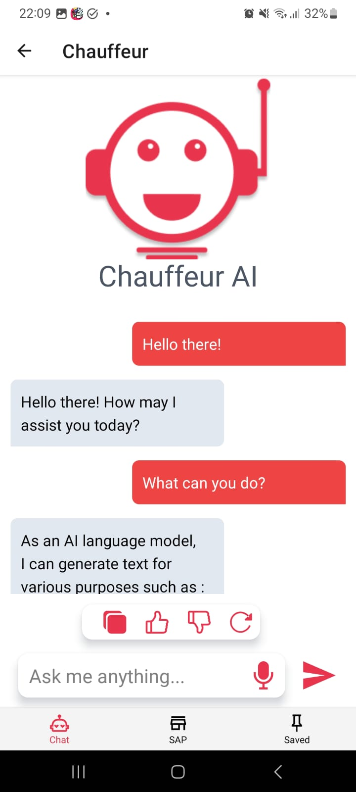
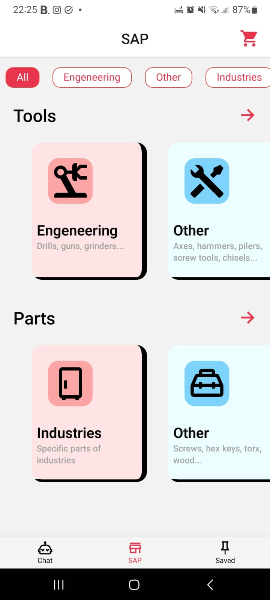
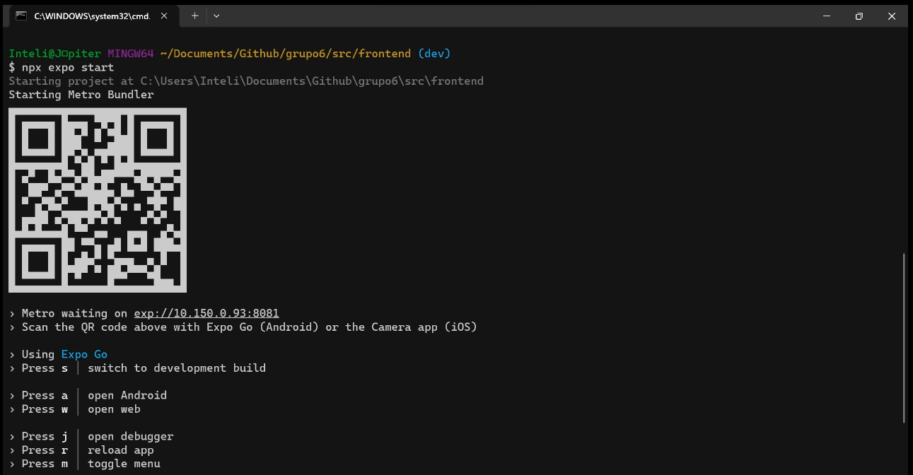

# Incremento da Interface Mobile

Anteriormente, apresentamos o protótipo da interface de usuário usando o Figma, conforme documentado. Na sprint 4, iniciamos o desenvolvimento da interface mobile utilizando [React Native](https://reactnative.dev).

O objetivo primordial da interface mobile é garantir a máxima intuitividade e acessibilidade. Além de promover aprendizado, buscamos criar uma interface gráfica portátil, otimizada para dispositivos com capacidade computacional limitada. Nosso principal propósito é integrar-se ao contexto da Ambev, aprimorando o fluxo de trabalho existente sem interrupções significativas, de modo a ser adotado por um amplo espectro de colaboradores. O processo no almoxarifado se concentra em permitir que os usuários façam pedidos por meio de seus celulares, dispositivos que estão presentes na maioria dos cenários da fábrica da Ambev, facilitando a requisição de peças de manutenção em diversos locais.

Optamos por um design simplificado para tornar a interface mais amigável. Reconhecemos que uma interface acessada por dispositivos móveis é mais prática, simplificando o processo para o usuário.

Além disso, reconhecemos o impacto significativo do mercado de aplicativos móveis na vida das pessoas. O que antes era exclusivo para a área técnica, a tecnologia móvel democratizou o acesso, transformando o cenário e impactando um público mais amplo.

# Arquitetura de Código
A arquitetura do frontend mobile segue o padrão do Next.js para aplicações web convencionais, organizada da seguinte maneira:

- **Components:** Esta pasta contém todos os componentes da aplicação, ou seja, os blocos que compõem as páginas.
  
- **Pages:** Aqui estão armazenadas todas as páginas compostas pelos componentes.

- **App.js:** Este arquivo renderiza todas as páginas na estrutura de uma aplicação web.


<div style={{"margin": "0 auto", "max-width": "400px", "display": "flex", "justify-content": "space-around"}}>

<div style={{"padding-right": "30px"}}>


</div>
</div>


Uma peculiaridade dessa arquitetura é sua semelhança com a lógica de desenvolvimento web convencional. No entanto, uma novidade para o grupo foi a estilização com CSS puro usando React. Para contornar isso, optamos por utilizar a biblioteca [Tailwind CSS](https://tailwindcss.com/docs/installation)
 para estilizar por meio de classnames. Essa escolha foi feita para acelerar a curva de aprendizado, uma vez que alguns membros do grupo tinham mais familiaridade com essa tecnologia.

Por fim, as bibliotecas para configuração dos passos posteriores:

- [React Native](https://reactnative.dev): Framework javascript para desenvolvimento mobile baseaado no [React](https://react.dev);
- [NativeWind](https://www.nativewind.dev): Framework css para desenvolvimento em react native baseado no [Tailwindcss](https://tailwindcss.com);
- [Expo](https://expo.dev): Framework para desenvolvimento mobile que compila e permite a execução do projeto e, também, o seu deploy.


**Fluxo de Uso da Aplicação Web**

A aplicação foi projetada com o intuito de proporcionar uma experiência simples e intuitiva, alinhada com as práticas comuns do mercado. Ao iniciar a aplicação em um dispositivo móvel, o usuário é recebido pela tela inicial, que oferece exclusivamente a opção de iniciar o fluxo. Vale ressaltar que, devido à natureza mobile do aplicativo, os usuários podem realizar multitarefas, como atender chamadas, enquanto utilizam o programa.

### Interface principal
A interface principal conta com botões(tabs) que permitem a navegação entre diferentes páginas, cada uma com funcionalidades específicas:

1. **Chat:** Nesta página, o usuário pode acessar o chat, estabelecendo uma conversa com o assistente virtual. A integração com nosso backend desempenha o papel de administrador para os nós que compõem a arquitetura. Como exemplo, as mensagens enviadas pelo usuário são processadas por uma API que encaminha a solicitação ao nosso LLM.

2. **SAP:** Destinada à integração com o Sistema de Controle de Registros da Ambev (SAP), esta página oferece uma visualização em formato de dashboards. Os usuários têm acesso à disponibilidade de peças no almoxarifado, proporcionando uma ferramenta valiosa para gestores e técnicos acompanharem as operações.

3. **Saved:** Nesta página, o usuário pode acessar uma lista de itens salvos. Essa funcionalidade atua como uma espécie de lista de compras, mantendo registros dos itens que o usuário solicitou, mas que não estavam disponíveis no momento. O objetivo principal é facilitar a gestão e o acompanhamento de requisitos não atendidos.

O design do aplicativo busca não apenas eficiência operacional, mas também acomodar a realização de tarefas cotidianas pelos usuários, garantindo uma experiência fluida e conveniente.


Tela da aplicação em seu menu inicial:

<div style={{"margin": "0 auto", "max-width": "400px", "display": "flex", "justify-content": "space-around"}}>

<div style={{"padding-right": "30px"}}>


</div>
</div>

### Interface do Chat

A interface do chat é projetada para facilitar a comunicação entre o usuário e a aplicação, incorporando as seguintes funcionalidades:

1. **Botões de Mensagem:** Na página de chat, o usuário pode interagir com o assistente virtual de diversas maneiras. Além de enviar mensagens, ele pode copiar o conteúdo das mensagens, marcar uma resposta como útil ou desfavorável e recarregar o chat para obter atualizações.

2. **Áudio:** A funcionalidade de áudio, representada pelo ícone de microfone no canto inferior direito, permite ao usuário enviar mensagens de voz para o sistema integrado. Quando ativado, o microfone envia a gravação de áudio para um nó de reconhecimento de fala (STT), que converte a fala em texto. Esse texto é então submetido ao sistema de síntese de fala (TTS) e posteriormente ao Modelo de Linguagem de Aprendizado Profundo (LLM). Esse processo possibilita a interação por meio de comandos de voz.

<div style={{"margin": "0 auto", "max-width": "400px", "display": "flex", "justify-content": "space-around"}}>

<div style={{"padding-right": "30px"}}>


</div>
</div>


### Interface de Integração com o SAP

A interface de integração com o SAP foi desenvolvida para otimizar a comunicação entre o conteúdo da plataforma e as informações armazenadas no sistema SAP. Funcionando como um filtro inicial da aplicação, destaca visualmente as peças de manutenção que estão indisponíveis, marcando-as em cinza. Além disso, essa página é concebida como um "chat rápido", apresentando as peças presentes no histórico do usuário e oferecendo recomendações. O usuário pode ajustar a quantidade desejada desses itens sem necessariamente interagir com o chat, proporcionando uma experiência de "chat express".

Principais funcionalidades incorporadas:

1. **Filtro Primário e Chat Rápido:** Na página do SAP, o usuário tem a flexibilidade de interagir com o assistente virtual de diversas maneiras. Em situações de pedidos rápidos, onde a interação com o chat não é necessária, o usuário pode simplesmente clicar na peça recomendada ou presente no histórico, transformando essa ação em uma espécie de "chat express".

2. **Quantidade de Materiais Disponíveis no Estoque:** A funcionalidade de quantidade possibilita que o usuário visualize a quantidade de peças disponíveis no almoxarifado. Para aprimorar essa funcionalidade, está sendo considerada a implementação de notificações ao usuário quando uma peça adicionada ao carrinho não estiver disponível no estoque, garantindo uma experiência mais informativa e eficiente.


<div style={{"margin": "0 auto", "max-width": "400px", "display": "flex", "justify-content": "space-around"}}>

<div style={{"padding-right": "30px"}}>



</div>
</div>


# Acessibilidade da aplicação
O design da interface destaca-se pela sua intuitividade e facilidade de uso, refletindo as cores e tipografia alinhadas à identidade visual do grupo Chauffeur, conforme apresentado em nossas demonstrações. A ênfase foi na adaptação para dispositivos móveis, proporcionando um fluxo de usuário descomplicado.

Quanto à usabilidade e acessibilidade da interface, é importante ressaltar que, atualmente, nenhum recurso foi implementado, dado que a aplicação ainda está em fase de desenvolvimento. No entanto, nosso roadmap inclui um plano estruturado para aprimorar a assistência oferecida pela aplicação. Uma das mudanças prioritárias envolve a personalização da interface web, visando tornar a experiência do usuário mais flexível e inclusiva, abordando diferentes perspectivas.

Estamos planejando implementar recursos que promovam acessibilidade, como opções de áudio, integrações com serviços dedicados e a inclusão de atributos "alt" em todas as imagens para fornecer descrições, garantindo uma experiência rica mesmo em casos nos quais as imagens não são renderizadas.

É importante salientar que a integração de todas as funcionalidades ao backend está em andamento, sendo desenvolvida de forma colaborativa. Questões relacionadas a essa integração serão abordadas em documentos futuros, à medida que avançamos no desenvolvimento do projeto.

## Execução do Frontend

Para executar o frontend do projeto, são necessárias algumas dependências. Siga os passos abaixo para garantir a correta execução da aplicação:

1. **Clone o repositório da aplicação do GitHub utilizando o seguinte comando:**
   ```
   git clone https://github.com/2023M8T2-Inteli/grupo6.git
   ```
   Execute este comando apenas se o projeto ainda não estiver clonado.

2. **Dirija-se ao diretório do repositório clonado, abra um terminal e execute o seguinte comando para instalar as dependências do Node.js:**
   ```
   npm i
   ```
   Este comando instala todas as dependências relacionadas ao Node.js e seus frameworks, React Native que é o que nos interessa.

3. **Agora que todas as dependências estão instaladas, é necessário executar o frontend. Navegue até o diretório 'frontend' contido em 'src' e execute o seguinte comando:**
   ```
   npm expo start
   ```

Após a execução deste comando, um QR code será exibido no terminal indicando que o frontend mobile está funcionando e pronto para cumprir seu papel. Escaneie o QR code, aceite todos os pedidos do app e aproveite o projeto.

<div style={{"margin": "0 auto", "max-width": "400px", "display": "flex", "justify-content": "space-around"}}>

<div style={{"padding-right": "30px"}}>



</div>
</div>

Link do frotend no github: https://github.com/2023M8T2-Inteli/grupo6/tree/dev/src/frontend
